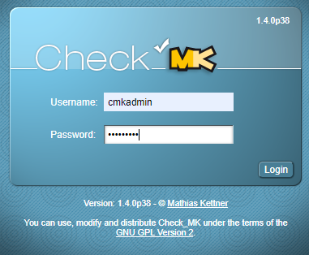

# Vagarnt-CheckMK
© By Flavio Paganini ST16E
## Inhaltsverzeichnis
* [Einleitung](#Einleitung) 
* [Setup](#Setup) 
* [Vagrant File](#Vagrant-File) 
  * [VM 1](#vm-config-1) 
  * [VM 2](#vm-config-2) 
* [Client in CheckMK aufnehmen](#client-in-checkmk-aufnehmen) 
## Einleitung
Dies ist die Dokumenation für das Vagrant File für einen CheckMK Server samt einem CheckMK Test Client. Der CheckMK Server ist sobal das Vagrantfile durchgelaufen ist über `http://localhost:8080/TBZSide/check_mk/login.py` ereichbar. Mit den Default einstellungen von dem Vagrantfile wird dem Benutzer `cmkadmin` das Passwort `Admin1234` gesetzt. Es werden zwei Boxen gestartet mit je 512MB Ram. Die beiden Boxen sind über ein Boxen internes Netzwerk verbunden. Der Server hat die IP `192.168.55.100` und der Client hat `192.168.55.101`. Der Client ist vom Host aus nur via SSH ereichbar, sonst ist er hinter der NAT Firewall von VirtualBox geschützt. Der CheckMK Server ist nur via Port 8080 und dem SSH Port ereichbar.

Die Idee für dieses Projekt habe ich gefunden weil bei uns in der Firma auch CheckMK benutzt wird und ich wollte schon immer einmal einen eigen CheckMK aufsetzten. Vagrant ist nicht Optimal für das aber so kann ich schon einmal testen wie CheckMK funktioniert um es danach als richtige VM zu Instalieren.
___
## Setup
    +---------------------------------------------------------------+
    ! Notebook - Schulnetz 10.x.x.x und Privates Netz 192.168.55.1  !                 
    ! Port: 8080 (192.158.55.101:80)                                !	
    !                                                               !	
    !    +--------------------+          +---------------------+    !
    !    ! CheckMK Server     !          ! CheckMK Client      !    ! 
    !    ! Host: checkmk      !          ! Host: client        !    !
    !    ! IP: 192.168.55.100 ! <------> ! IP: 192.168.55.101  !    !
    !    ! Port: 80           !          ! Port: -             !    !
    !    ! Nat: 8080          !          ! Nat: -              !    !
    !    +--------------------+          +---------------------+    !
    !                                                               !	
    +---------------------------------------------------------------+
Das Setup ist ganz einfach:
1. In das geklonte Verzeichnis wechseln.
2. cmd.exe als Admin ausführen.
3. "vagrant up" eingeben.
4. Kurz Warten :-) bis `Reading state information... Done` in der Konsole steht.
5. [CheckMk Starten](http://localhost:8080/TBZSide/check_mk/login.py).
6. Mit dem User `cmkadmin` und dem Passwort `Admin1234` anmelden.
7. Fertig!
___
## Vagrant File
In diesem Teil wird das Vagrantfile beschriben.
### VM Config 1
    Vagrant.configure(VAGRANTFILE_API_VERSION) do |config|
        config.vm.define "checkmk" do |checkmk|
        checkmk.vm.box = "ubuntu/xenial64"
        checkmk.vm.hostname = "server"
        checkmk.vm.network "private_network", ip:"192.168.55.100" 
        checkmk.vm.network "forwarded_port", guest:80, host:8080, auto_correct: true
        checkmk.vm.provider "virtualbox" do |vb|
	  vb.memory = "512"  
	end   
In diesem Teil wird die ester VM definiert, in diesem Fall der Server. Die Box für diesen Service ist die `ubuntu/xenial64` Box. Der Hostname wird auf `Server` gesetzt. Die VM bekommt zwei Adapter einen NAT und den anderen in einem intern Netzwerk. Der Nat-Netzwerkadapter leitet den Internen Port 80 auf den Port 8080 um, zusätzlich wird von Vagrant der SSH, dieser Port ist Dynamisch. Das interne Netzwerk ist für die komunikation zwischen Server und dem Client. Der Server hat die die interne IP `192.168.55.100`. Der Vm wird 512 MB Ram zugewiesen, was für ein kleines Liunux reicht.
### VM Befehl
    checkmk.vm.provision "shell", inline: <<-SHELL
		    sudo apt-get update
		    sudo wget https://mathias-kettner.de/support/Check_MK-pubkey.gpg
		    sudo wget https://mathias-kettner.de/support/1.4.0p38/check-mk-raw-1.4.0p38_0.xenial_amd64.deb
		    sudo apt-key add Check_MK-pubkey.gpg
                sudo apt-get -y install gdebi-core
                sudo gdebi -n check-mk-raw-1.4.0p38_0.xenial_amd64.deb
                sudo omd create TBZSide
                sudo omd start TBZSide
                wget http://192.168.55.100/TBZSide/check_mk/agents/check-mk-agent_1.4.0p38-1_all.deb
                sudo gdebi -n check-mk-agent_1.4.0p38-1_all.deb
                cd /omd/sites/TBZSide/etc
                sudo rm htpasswd
                sudo su
                htpasswd -nb cmkadmin Admin1234 > htpasswd
                exit
        SHELL
        end
In diesem Teil sind die einzelnen Befhle die nach der Instalation ausgeführt weden beschriben:

`sudo apt-get update` fürhrt ein Update aus.

`sudo wget https://mathias-kettner.de/support/Check_MK-pubkey.gpg` lädt den Public Key herunter.

`sudo wget https://mathias-kettner.de/support/1.4.0p38/check-mk-raw-1.4.0p38_0.xenial_amd64.deb` läd die CheckMK Instalations Datei herunter von der Ofizielen Seite.

`sudo apt-key add Check_MK-pubkey.gpg` fügt den Public Key hinzu damit dan es auch instaliert werden kann.

`sudo apt-get -y install gdebi-core` instaliert gdebi welches für die Instalation benötigt wird.

`sudo gdebi -n check-mk-raw-1.4.0p38_0.xenial_amd64.deb` instaliert mit gdebi CheckMK, der Parameter -n instaliert es ohne nachzufragen.

`sudo omd create TBZSide` mit diesem Befehl wird in CheckMK eine neue Seite erstellt, für hier wird sie TBZSide genant.

`sudo omd start TBZSide` mit disem Befehl wird die vorhin erstellte seite gestartet.

`wget http://192.168.55.100/TBZSide/check_mk/agents/check-mk-agent_1.4.0p38-1_all.deb` Mit diesem Befel wird der CheckMK Agent auf dem Server heruntergeladen.

`sudo gdebi -n check-mk-agent_1.4.0p38-1_all.deb` Instaliert den herunter geladen Agent.

`cd /omd/sites/TBZSide/etc` Wechslen in das Web Root Verzeichnis der Webseite.

`sudo rm htpasswd` Löschen der alten `htpasswd` Datei.

`sudo su` in den Root User wechseln.

`htpasswd -nb cmkadmin Admin1234 > htpasswd` Neue htpasswd erstellen mit dem User `cmkadmin` und dem Passwort `Admin1234`.

`exit` Beenden der Konsole.

### VM Config 2
    config.vm.define "client" do |client|
    	client.vm.box = "ubuntu/xenial64"
    	client.vm.hostname = "client"
    	client.vm.network "private_network", ip:"192.168.55.101" 
	client.vm.provider "virtualbox" do |vb|
		vb.memory = "512"  
	end    
In diesem Teil wird die zweite VM definiert, in diesem Fall der Client. Die Box für diesen Service ist die `ubuntu/xenial64` Box. Der Hostname wird auf `client` gesetzt. Die VM bekommt nur ein Adapter der von dem intern Netzwerk. Das interne Netzwerk ist für die komunikation zwischen Server und dem Client benutzt. Der Client hat die die interne IP `192.168.55.101`. Der Vm wird 512 MB Ram zugewiesen, was für ein kleines Liunux reicht.
### VM Befehl
	client.vm.provision "shell", inline: <<-SHELL
		sudo apt-get -y install gdebi-core
		sudo apt-get -y install xinetd
		wget http://192.168.55.100/TBZSide/check_mk/agents/check-mk-agent_1.4.0p38-1_all.deb
		sudo gdebi -n check-mk-agent_1.4.0p38-1_all.deb
		SHELL
	end

`sudo apt-get -y install gdebi-core` instaliert gdebi welches für die Instalation benötigt wird.

`sudo apt-get -y install xinetd` instaliert xinetd welches für die Instalation benötigt wird.

`wget http://192.168.55.100/TBZSide/check_mk/agents/check-mk-agent_1.4.0p38-1_all.deb` Mit diesem Befel wird der CheckMK Agent auf dem Client heruntergeladen.

`sudo gdebi -n check-mk-agent_1.4.0p38-1_all.deb` Instaliert den herunter geladen Agent.

Schon ist der Client bereit in CheckMK aufgennomen zu werden.

___
## Client in CheckMK Aufnehmen
Sobald der die Instalation abgeschlossen ist kann man CheckMK öffnen [Link](http://localhost:8080/TBZSide/check_mk/login.py). Danach meldet man sich mit `cmkadmin` und `Admin1234` an.   Auf dem Dashboard von CheckMK geht man dan Links unter `WATO - Configuration`   auf Hosts und dan gibt es oben einen Button `New Host`.  Bei dem Hostname gibt man die IP des Clients an den Man überwachen möchte. In diesem Fall die IP `192.168.55.101`. Danach kann man unten auf `Save & Test`. In der Service übersicht sieht man die möglichen Services die überwacht werden können. Mit dem klick auf `Monitor all` kann man alle verfügbaren Services überwachen. Danach muss man diese Änderung nur noch speichen, dies kann  damit
